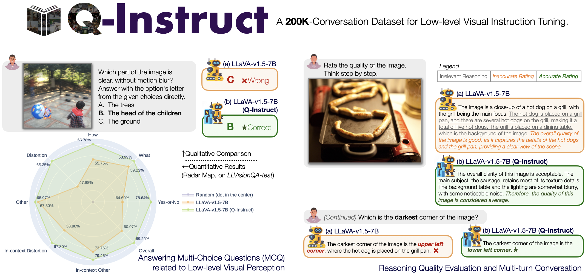

    

  <h1>Q-Instruct: Improving Low-level Visual Abilities for Multi-modality Foundation Models</h1>

  

      <a href="https://teowu.github.io/" target="_blank">Haoning Wu</a>1*,
      <a href="https://github.com/zzc-1998" target="_blank">Zicheng Zhang</a>2*,
      <a href="https://github.com/ZhangErliCarl/" target="_blank">Erli Zhang</a>1*,
      <a href="https://chaofengc.github.io" target="_blank">Chaofeng Chen</a>1,
      <a href="https://liaoliang92.github.io" target="_blank">Liang Liao</a>1,
      <a href="https://github.com/AnnanWangDaniel" target="_blank">Annan Wang</a>1,
  

      <a href="https://scholar.google.com/citations?user=NBIqaHQAAAAJ&hl=en" target="_blank">Kaixin Xu</a>4,
      <a href="https://github.com/lcysyzxdxc" target="_blank">Chunyi Li</a>2,
      <a href="https://scholar.google.com.sg/citations?user=NlNOyiQAAAAJ&hl=en" target="_blank">Jingwen Hou</a>1,
      <a href="https://ee.sjtu.edu.cn/en/FacultyDetail.aspx?id=24&infoid=153&flag=153" target="_blank">Guangtao Zhai</a>2,
      <a href="https://scholar.google.com/citations?user=ZYVZ1bgAAAAJ&hl=en" target="_blank">Geng Xue</a>4,
      <a href="https://wenxiusun.com" target="_blank">Wenxiu Sun</a>3,
      <a href="https://scholar.google.com/citations?user=uT9CtPYAAAAJ&hl=en" target="_blank">Qiong Yan</a>3,
      <a href="https://personal.ntu.edu.sg/wslin/Home.html" target="_blank">Weisi Lin</a>1#
  

  

  1Nanyang Technological University, 2Shanghai Jiaotong University, 3Sensetime Research, 4I2R@A*STAR
       
   

*Equal contribution. #Corresponding author. 
   

   <a href="https://huggingface.co/datasets/nanyangtu/Q-Instruct"><strong>Dataset (preview version)</strong></a>
   
   

    
  

      
  

  
   

Our paper, pre-trained weights, and training instructions are coming soon.
