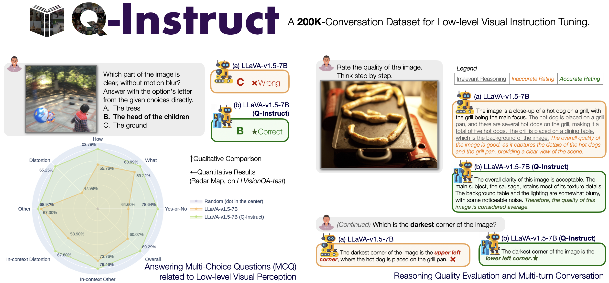
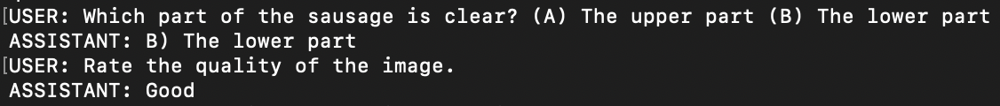

<div align="center">

<div align="center">
    <a href="https://huggingface.co/spaces/teowu/Q-Instruct-on-mPLUG-Owl-2"></a>
<a href="https://arxiv.org/abs/2311.06783"></a>
    <a href="https://huggingface.co/datasets/teowu/Q-Instruct"></a>
    <a href="https://hits.seeyoufarm.com"></a>
    <a href='https://github.com/Q-Future/Q-Instruct/stargazers'></a>
</div>


  <h1>Q-Instruct: Improving Low-level Visual Abilities for Multi-modality Foundation Models</h1>


  <div>
      <a href="https://teowu.github.io/" target="_blank">Haoning Wu</a><sup>1</sup><sup>*</sup>,
      <a href="https://github.com/zzc-1998" target="_blank">Zicheng Zhang</a><sup>2</sup><sup>*</sup>,
      <a href="https://github.com/ZhangErliCarl/" target="_blank">Erli Zhang</a><sup>1</sup><sup>*</sup>,
      <a href="https://chaofengc.github.io" target="_blank">Chaofeng Chen</a><sup>1</sup>,
      <a href="https://liaoliang92.github.io" target="_blank">Liang Liao</a><sup>1</sup>,
      <a href="https://github.com/AnnanWangDaniel" target="_blank">Annan Wang</a><sup>1</sup>,
      <a href="https://scholar.google.com/citations?user=NBIqaHQAAAAJ&hl=en" target="_blank">Kaixin Xu</a><sup>4</sup>,
  </div>

<div>
      <a href="https://github.com/lcysyzxdxc" target="_blank">Chunyi Li</a><sup>2</sup>,
      <a href="https://scholar.google.com.sg/citations?user=NlNOyiQAAAAJ&hl=en" target="_blank">Jingwen Hou</a><sup>1</sup>,
      <a href="https://ee.sjtu.edu.cn/en/FacultyDetail.aspx?id=24&infoid=153&flag=153" target="_blank">Guangtao Zhai</a><sup>2</sup>,
      <a href="https://scholar.google.com/citations?user=ZYVZ1bgAAAAJ&hl=en" target="_blank">Geng Xue</a><sup>4</sup>,
      <a href="https://wenxiusun.com" target="_blank">Wenxiu Sun</a><sup>3</sup>,
      <a href="https://scholar.google.com/citations?user=uT9CtPYAAAAJ&hl=en" target="_blank">Qiong Yan</a><sup>3</sup>,
      <a href="https://personal.ntu.edu.sg/wslin/Home.html" target="_blank">Weisi Lin</a><sup>1</sup><sup>#</sup>
  </div>
  <div>
  <sup>1</sup>Nanyang Technological University, <sup>2</sup>Shanghai Jiaotong University, <sup>3</sup>Sensetime Research, <sup>4</sup>I2R@A*STAR
       </div>   
<div>
<sup>*</sup>Equal contribution. <sup>#</sup>Corresponding author. 
   </div>
<div>
   <a href="https://huggingface.co/datasets/teowu/Q-Instruct"><strong>Dataset</strong></a> | <a href="https://github.com/Q-Future/Q-Instruct/tree/main/model_zoo"><strong>Model Zoo</strong></a> |  <a href="https://github.com/Q-Future/Q-Instruct/tree/main/fig/Q_Instruct_v0_1_preview.pdf"><strong>Paper (Preview)</strong></a> | <a href="https://huggingface.co/spaces/teowu/Q-Instruct-on-mPLUG-Owl-2"><strong>Demo (Huggingface)</strong></a>
   </div>   

    
  <div style="width: 100%; text-align: center; margin:auto;">
      
  </div>
  </div>   
  
  
## Quick Start

If your server is facing a poor connection to Hugging Face, we provide an alternative way to [Download Weights from ModelScope](model_zoo/#modelscope). Click in to see details.

对于中国大陆地区的使用者，若您的服务器连接huggingface存在一些困难，我们亦提供通过*魔搭*下载权重的方式。敬请点击参阅[指南](model_zoo/#modelscope)。


### LLaVA-v1.5

#### Install LLaVA.

```shell
git clone https://github.com/haotian-liu/LLaVA.git
cd LLaVA
pip install -e .
```

#### Simple Interactive Demos.

*See the codes and scripts below.*

<details>
<summary>Example Code (Single Query)</summary>
    
```python
from llava.mm_utils import get_model_name_from_path
from llava.eval.run_llava import eval_model
model_path = "teowu/llava_v1.5_7b_qinstruct_preview_v0.1" 
prompt = "Rate the quality of the image. Think step by step."
image_file = "fig/sausage.jpg"
args = type('Args', (), {
    "model_path": model_path,
    "model_base": None,
    "model_name": get_model_name_from_path(model_path),
    "query": prompt,
    "conv_mode": None,
    "image_file": image_file,
    "sep": ",",
})()
eval_model(args)
```
</details>


<details>
<summary>Example Code (CLI Demo for Multi-turn Conversation)</summary>
    
```shell
python -m llava.serve.cli \
    --model-path teowu/llava_v1.5_7b_qinstruct_preview_v0.1 \
    --image-file "fig/sausage.jpg" \
```

<div style="width: 60%; text-align: center; margin:auto;">
    
</div>

Note: The results may contain randomness as `do_sample=True` is enabled during conversation mode. 

</details>

#### Quantitative Evaluations

<details>
<summary>Multi-choice question (MCQ) in Q-Bench.</summary>
    
```shell
python eval_scripts/llava_v1.5/eval_qbench_mcq.py
```
    
</details>


<details>
<summary>Image/Video Quality Assessment</summary>

<strong>Image Quality Assessment:</strong>
    
```shell
python eval_scripts/llava_v1.5/eval_image_quality.py
```
    
<strong>Video Quality Assessment:</strong>

```shell
python eval_scripts/llava_v1.5/eval_video_quality.py
```

</details>

### mPLUG-Owl-2

*For mPLUG-Owl-2, Only Single GPU Inference is supported now. Please set environmental variable (e.g. `export CUDA_VISIBLE_DEVICES=0`) to make sure that the model can be loaded on only one device.*


#### Install mPLUG-Owl-2.

```shell
git clone https://github.com/X-PLUG/mPLUG-Owl.git
cd mPLUG_Owl/mPLUG_Owl2/ 
pip install -e .
```

#### Simple Interactive Demos

<details>
<summary>Example Code (Single Query)</summary>
    
```python
from mplug_owl2.mm_utils import get_model_name_from_path
from eval_scripts.mplug_owl_2.run_mplug_owl2 import eval_model
model_path = "teowu/mplug_owl2_7b_448_qinstruct_preview_v0.1" 
prompt = "Rate the quality of the image. Think step by step."
image_file = "fig/sausage.jpg"
args = type('Args', (), {
    "model_path": model_path,
    "model_base": None,
    "model_name": get_model_name_from_path(model_path),
    "query": prompt,
    "conv_mode": None,
    "image_file": image_file,
    "sep": ",",
})()
eval_model(args)
```

</details>

<details>
<summary>Example Code (CLI Demo for Multi-turn Conversation)</summary>
    
```shell
python -m mplug_owl2.serve.cli \
    --model-path teowu/mplug_owl2_7b_448_qinstruct_preview_v0.1 \
    --image-file "fig/sausage.jpg" \
```

<div style="width: 60%; text-align: center; margin:auto;">
    
</div>

Note: The results may contain randomness as `do_sample=True` is enabled during conversation mode. 

</details>

#### Quantitative Evaluations

<details>
<summary>Multi-choice question (MCQ) in Q-Bench.</summary>
    
```shell
python eval_scripts/mplug_owl_2/eval_qbench_mcq.py
```

</details>


<details>
<summary>Image/Video Quality Assessment</summary>

<strong>Image Quality Assessment:</strong>
    
```shell
python eval_scripts/mplug_owl_2/eval_image_quality.py
```
    
<strong>Video Quality Assessment:</strong>

```shell
python eval_scripts/mplug_owl_2/eval_video_quality.py
```

</details>


### InternLM-XComposer-VL

*InternLM-XComposer-VL has been integrated into Hugging Face `AutoModel` (remote code mode). You can directly start with the code below without a separate install process.*

#### Simple Interactive Demos

<details>
<summary>Example Code (Single Query)</summary>
    
```python
import torch
from transformers import AutoModel, AutoTokenizer

torch.set_grad_enabled(False)

# init model and tokenizer
model = AutoModel.from_pretrained('DLight1551/internlm-xcomposer-vl-7b-qinstruct-full', trust_remote_code=True).cuda().eval()
tokenizer = AutoTokenizer.from_pretrained('DLight1551/internlm-xcomposer-vl-7b-qinstruct-full', trust_remote_code=True)
model.tokenizer = tokenizer

# Single-Turn Text-Image Dialogue
text = 'Describe and evaluate the quality of the image.'
image = 'fig/sausage.jpg'
response = model.generate(text, image)
print(response)
```
   
</details>

<details>
<summary>Example Code (Multi-Turn Conversation)</summary>
    
```python
import torch
from transformers import AutoModel, AutoTokenizer

torch.set_grad_enabled(False)

# init model and tokenizer
model = AutoModel.from_pretrained('DLight1551/internlm-xcomposer-vl-7b-qinstruct-full', trust_remote_code=True).cuda().eval()
tokenizer = AutoTokenizer.from_pretrained('DLight1551/internlm-xcomposer-vl-7b-qinstruct-full', trust_remote_code=True)
model.tokenizer = tokenizer

# Multi-Turn Dialogue
text = 'Describe and evaluate the quality of the image.'
image = 'fig/sausage.jpg'
response, history = model.chat(text, image, history=None)
print(f'User: {text}')
print(f'Bot: {response}')

text = 'Which part of the pan is clearer, the top part of the bottom part?'
response, history = model.chat(text=text, image=None, history=history)
print(f'User: {text}')
print(f'Bot: {response}')
```
   
</details>


#### Quantitative Evaluations


<details>
<summary>Multi-choice question (MCQ) in Q-Bench.</summary>
    
```shell
python eval_scripts/internlm_xcomposer_vl/eval_qbench_mcq.py
```

</details>


<details>
<summary>Image/Video Quality Assessment</summary>

<strong>Image Quality Assessment:</strong>
    
```shell
python eval_scripts/internlm_xcomposer_vl/eval_image_quality.py
```
    
<strong>Video Quality Assessment:</strong>

```shell
python eval_scripts/internlm_xcomposer_vl/eval_video_quality.py
```

</details>


## Model Zoo

See [Model Zoo](model_zoo). Both **Hugging Face** and **modelscope** weights are provided.

## Training

At present, we only provide the training scripts with LLaVA-v1.5 (7B/13B). Please see [Training Docs](scripts/llava_v1.5) for more details.

## License

Researchers and open-source developers are **free** to use the **Q-Instruct** dataset and the fine-tuned weights as provided for the four MLLMs. We also allow commercial use, while any commercial use should be pre-permitted by our team. Please email `haoning001@e.ntu.edu.sg` to gain the permission for commercial use.

