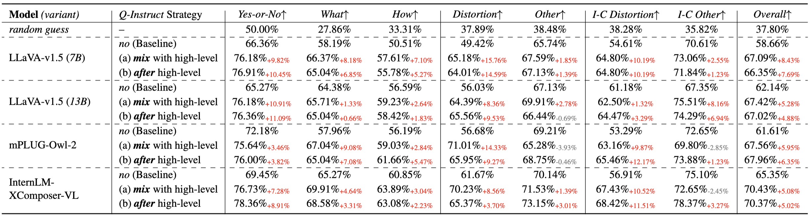
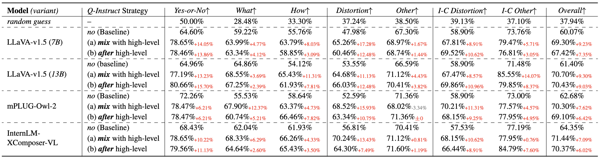
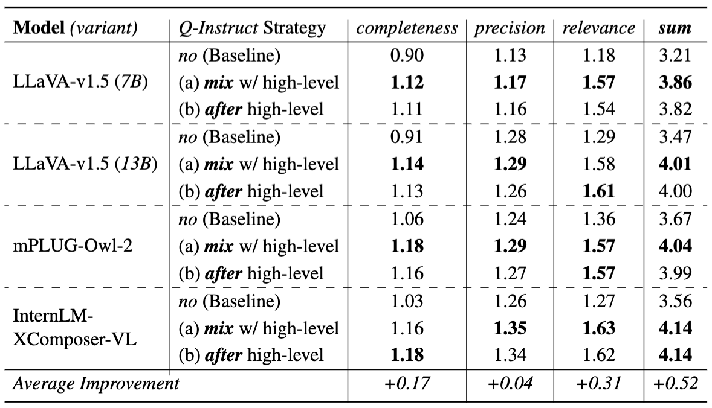
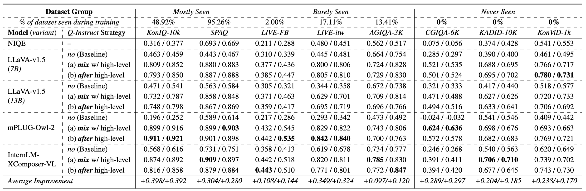

## Results

### Answering Multi-Choice Questions

#### Quantitative Results

- `dev` subset of [LLVisionQA](https://huggingface.co/datasets/nanyangtu/LLVisionQA-QBench).

  

      
  
 
  
- `test` subset of [LLVisionQA](https://huggingface.co/datasets/nanyangtu/LLVisionQA-QBench).

  

      
  
 

### General Description on Low-level Visual Aspects

#### Quantitative Results

- Results on [LLDescribe](https://huggingface.co/datasets/nanyangtu/LLDescribe-QBench).

  

      
  
 

### Image and Video Quality Assessment

#### Quantitative Results

- Impressive results on 8 IQA/VQA datasets, including 3 *never seen* datasets (CGIQA-6K, KADID-10K, KoNViD-10k).

  

      
  
 
  
- The results are obtained with text-only instruction tuning, **without any numerical supervision**.