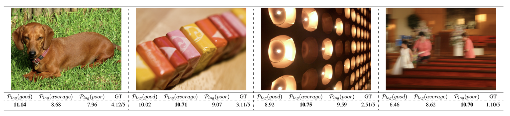

# Q-Boost

### TL; DR

An almost *zero-cost* improvement for IQA on Q-Instruct-pretrained models.

### Results



### Usage

```python
from boost_qa.model import QInstructScorer as Scorer
scorer = Scorer(boost=True)
```

### Abstract

Recent advancements in Multi-modality Large Language Models (MLLMs) have demonstrated remarkable capabilities in complex high-level vision tasks. However, the exploration of MLLM potential in visual quality assessment, a vital aspect of low-level vision, remains limited. To address this gap, we introduce Q-Boost, a novel strategy designed to enhance low-level MLLMs in image quality assessment (IQA) and video quality assessment (VQA) tasks, which is structured around two pivotal components: 1) Triadic-Tone Integration: Ordinary prompt design simply oscillates between the binary extremes of positive and negative. Q-Boost innovates by incorporating a `middle ground' approach through neutral prompts, allowing for a more balanced and detailed assessment. 2) Multi-Prompt Ensemble: Multiple quality-centric prompts are used to mitigate bias and acquire more accurate evaluation. The experimental results show that the low-level MLLMs exhibit outstanding zeros-shot performance on the IQA/VQA tasks equipped with the Q-Boost strategy.

### Citation

```bibtex
@misc{zhang2023qboost,
      title={Q-Boost: On Visual Quality Assessment Ability of Low-level Multi-Modality Foundation Models}, 
      author={Zicheng Zhang and Haoning Wu and Zhongpeng Ji and Chunyi Li and Erli Zhang and Wei Sun and Xiaohong Liu and Xiongkuo Min and Fengyu Sun and Shangling Jui and Weisi Lin and Guangtao Zhai},
      year={2023},
      eprint={2312.15300},
      archivePrefix={arXiv},
      primaryClass={cs.CV}   
}
```
