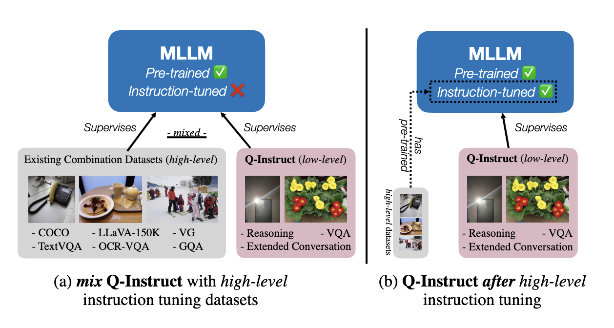

## Train@mPLUG-Owl-2

This document provides instruction on how to train with **Q-Instruct** dataset on mPLUG-Owl-2 (LLaMA2-7B), under the proposed two strategies (***mix*** and ***after***), shown as follows.



*Due to copyright issues, the pre-trained weights of mPLUG-Owl-2 is not available at present. Therefore, the open-source mix strategy at present is slightly different, that we need to use a mix of **high-level datasets** and **Q-Instruct** on the SFT checkpoint of mPLUG-Owl-2.*

### Step 0: Pre-requisites

Install [mPLUG-Owl](https://github.com/X-PLUG/mPLUG-Owl/) under the main repository, with flash attention for more efficient training.

```shell
git clone https://github.com/X-PLUG/mPLUG-Owl.git
cd mPLUG-Owl/mPLUG-Owl2
pip install -e ".[train]"
pip install flash_attn --no-build-isolation
cd ..
```

After that, you can conduct *low-level visual instruction tuning* as follows, under either ***mix*** or ***after*** strategy.

### Step 1: Download Training Datasets


#### Download Q-Instruct

*Note: If you have already downloaded for LLaVA, you may directly copy them here.*

For the **Q-Instruct** dataset, download them directly via the following script:

```shell
cd mPLUG-Owl/mPLUG-Owl2/playground/data
wget https://huggingface.co/datasets/teowu/Q-Instruct/resolve/main/cleaned_labels.json
wget https://huggingface.co/datasets/teowu/Q-Instruct/resolve/main/q-instruct-images.tar
tar -xf q-instruct-images.tar
rm -f q-instruct-images.tar
cd ../../../..
```

Make sure you have the file structures as follows under `LLaVA/playground/data`.

```
├── spaq_koniq
├── livefb_liveitw_aigc
├── cleaned_labels.json
```

#### Download Public High-level Instruction Tuning Datasets

*Note: If you have already downloaded for LLaVA, you may directly copy them here.*

If you choose the ***mix*** strategy, the high-level datasets also need to be downloaded via the following steps:


1. Download the annotation of the final mixture our instruction tuning data [llava_v1_5_mix665k.json](https://huggingface.co/datasets/liuhaotian/LLaVA-Instruct-150K/blob/main/llava_v1_5_mix665k.json):

```shell
wget -P mPLUG-Owl/mPLUG-Owl2/playground/data https://huggingface.co/datasets/liuhaotian/LLaVA-Instruct-150K/blob/main/llava_v1_5_mix665k.json
```

2. Download the images from constituting datasets:

- COCO: [train2017](http://images.cocodataset.org/zips/train2017.zip)
- GQA: [images](https://downloads.cs.stanford.edu/nlp/data/gqa/images.zip)
- OCR-VQA: [download script](https://drive.google.com/drive/folders/1_GYPY5UkUy7HIcR0zq3ZCFgeZN7BAfm_?usp=sharing), **we save all files as `.jpg`**
- TextVQA: [train_val_images](https://dl.fbaipublicfiles.com/textvqa/images/train_val_images.zip)
- VisualGenome: [part1](https://cs.stanford.edu/people/rak248/VG_100K_2/images.zip), [part2](https://cs.stanford.edu/people/rak248/VG_100K_2/images2.zip)

After downloading all of them, organize the high-level data as follows in `LLaVA/playground/data`,

```
├── coco
│   └── train2017
├── gqa
│   └── images
├── ocr_vqa
│   └── images
├── textvqa
│   └── train_images
└── vg
    ├── VG_100K
    └── VG_100K_2
```

3. Merge the **Q-Instruct** labels with labels from high-level datasets.

```shell
jq -s 'add' mPLUG-Owl/mPLUG-Owl2/playground/data/cleaned_labels.json mPLUG-Owl/mPLUG-Owl2/playground/data/llava_v1_5_mix665k.json > mPLUG-Owl/mPLUG-Owl2/playground/data/mix_cleaned_labels.json
```


### Step 2: Start Training

Please make sure you have enough computational resources before training.

- [Must Do!] Replace all the `<image>` token in the json into `<|image|>`, Otherwise the image will not be loaded into training.

```shell
sed -i 's/<image>/<|image|>/g' mPLUG-Owl/mPLUG-Owl2/playground/data/mix_cleaned_labels.json
```

#### Strategy (a): Mix with High-level Datasets

- Training *(requires 8x A100 80G), 11h*

```shell
sh scripts/mplug_owl_2/mix_qinstruct.sh
```

#### Strategy (b): After High-level Datasets

- Training *(requires 8x A100 80G), 1.5h*

```shell
sh scripts/mplug_owl_2/after_qinstruct.sh
```